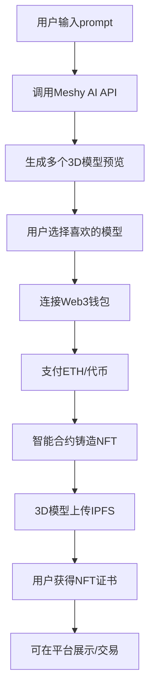

# 3D NFT 前端业务设计

## 📋 业务流程

### 核心用户故事
> 作为用户，我希望通过文本描述生成独一无二的3D模型NFT，并在区块链上拥有该数字资产的所有权

### 主要业务流程



## 🎯 核心功能模块

### 1. AI 生成模块 (AI Generation)
**页面**: `/generate`

**主要功能**:
- 文本prompt输入界面
- 高级参数设置 (模型类型、风格、复杂度)
- 生成进度跟踪
- 多种3D模型预览展示

**UI组件**:
```
PromptInput - 智能提示输入框
GenerationSettings - 生成参数面板
ModelPreview - 3D模型预览器 (Three.js)
GenerationProgress - 生成进度条
ModelGallery - 生成结果展示
```

### 2. 模型预览模块 (Model Viewer)
**页面**: `/preview/:taskId`

**主要功能**:
- 360度3D模型查看
- 缩放、旋转、平移控制
- 模型质量预览
- 下载高质量模型文件
- 模型参数信息显示

**UI组件**:
```
ModelViewer3D - 主要3D查看器
ViewerControls - 视图控制面板
ModelInfo - 模型信息卡片
QualitySelector - 质量选择器
DownloadButton - 下载按钮
```

### 3. Web3 集成模块 (Web3 Integration)
**页面**: 全局集成

**主要功能**:
- 钱包连接 (MetaMask, WalletConnect)
- 余额查询
- 交易签名
- 网络切换
- 交易状态跟踪

**UI组件**:
```
WalletConnect - 钱包连接按钮
BalanceDisplay - 余额显示
NetworkSelector - 网络选择器
TransactionModal - 交易确认弹窗
TransactionStatus - 交易状态跟踪
```

### 4. NFT 铸造模块 (NFT Minting)
**页面**: `/mint/:modelId`

**主要功能**:
- NFT元数据编辑
- 价格设置和支付
- 智能合约交互
- IPFS上传
- 铸造确认

**UI组件**:
```
NFTMetadataForm - NFT信息编辑表单
PriceCalculator - 价格计算器
PaymentConfirm - 支付确认
IPFSUploader - IPFS上传组件
MintingStatus - 铸造状态跟踪
```

### 5. 用户资产模块 (User Assets)
**页面**: `/profile`, `/collection`

**主要功能**:
- 个人NFT收藏展示
- 3D模型管理
- 交易历史
- 转售市场
- 资产统计

**UI组件**:
```
ProfileHeader - 用户信息头部
NFTCollection - NFT收藏网格
AssetCard - 单个资产卡片
TransactionHistory - 交易历史列表
MarketplaceIntegration - 市场集成
```

### 6. 市场展示模块 (Marketplace)
**页面**: `/marketplace`, `/explore`

**主要功能**:
- 公开NFT展示
- 搜索和筛选
- 热门推荐
- 类别浏览
- 详情页面

**UI组件**:
```
MarketplaceHeader - 市场页头部
SearchFilters - 搜索筛选器
NFTGrid - NFT网格展示
CategoryTabs - 分类标签
FeaturedSection - 精选区域
```

## 🏗️ 技术架构

### 前端技术栈
```json
{
  "framework": "Next.js 15 (App Router)",
  "language": "TypeScript",
  "styling": "Tailwind CSS 4",
  "3d_engine": "React Three Fiber + Three.js",
  "web3": "wagmi + viem",
  "state": "Zustand + React Query",
  "ui_library": "shadcn/ui + Radix UI"
}
```

### 页面路由结构
```
/                     - 首页 (Hero + 特色展示)
/generate             - AI生成页面
/preview/:taskId      - 模型预览页面
/mint/:modelId        - NFT铸造页面
/profile              - 个人中心
/collection           - 个人收藏
/marketplace          - NFT市场
/explore              - 发现页面
/asset/:tokenId       - NFT详情页面
/history              - 交易历史
```

### 状态管理设计
```typescript
// 应用状态结构
interface AppState {
  user: {
    address: string | null;
    balance: bigint;
    nftCount: number;
  };
  generation: {
    currentTask: string | null;
    progress: number;
    results: Model3D[];
  };
  web3: {
    isConnected: boolean;
    network: string;
    contracts: ContractAddresses;
  };
  marketplace: {
    featuredNFTs: NFTItem[];
    filters: FilterState;
    searchResults: NFTItem[];
  };
}
```

## 🔗 API 接口需求

### 1. Meshy AI 集成
```typescript
// 3D模型生成API
interface MeshyAPI {
  // 提交生成任务
  submitGeneration(prompt: string, settings: GenerationSettings): Promise<TaskResponse>;
  
  // 查询任务状态
  getTaskStatus(taskId: string): Promise<TaskStatus>;
  
  // 获取生成结果
  getTaskResult(taskId: string): Promise<Model3DResult[]>;
  
  // 下载模型文件
  downloadModel(modelId: string, format: 'glb' | 'fbx' | 'obj'): Promise<Blob>;
}
```

### 2. IPFS 存储集成
```typescript
// IPFS上传服务
interface IPFSService {
  // 上传3D模型文件
  uploadModel(file: File): Promise<IPFSHash>;
  
  // 上传NFT元数据
  uploadMetadata(metadata: NFTMetadata): Promise<IPFSHash>;
  
  // 获取文件URL
  getFileURL(hash: string): string;
}
```

### 3. 智能合约接口
```typescript
// NFT合约交互
interface NFTContract {
  // 铸造NFT
  mint(to: string, tokenURI: string, price: bigint): Promise<TransactionHash>;
  
  // 查询NFT信息
  getTokenInfo(tokenId: bigint): Promise<TokenInfo>;
  
  // 转移NFT
  transfer(from: string, to: string, tokenId: bigint): Promise<TransactionHash>;
  
  // 查询用户NFT
  getUserTokens(address: string): Promise<bigint[]>;
}
```

## 🎨 用户体验设计

### 设计原则
1. **简洁直观**: 降低Web3使用门槛
2. **视觉震撼**: 突出3D模型展示效果
3. **流程顺畅**: 从生成到铸造一键完成
4. **性能优化**: 3D模型流畅加载和渲染

### 响应式设计
- **桌面端**: 完整功能体验，支持复杂3D交互
- **平板端**: 优化触控操作，简化界面布局
- **移动端**: 核心功能精简，适配小屏幕浏览

### 暗色主题适配
- 科技感配色方案
- 3D模型背景优化
- 高对比度文字显示

## 📱 核心页面原型

### 1. 生成页面 (`/generate`)
```
┌─────────────────────────────────────┐
│ Header: Logo | Wallet Connect       │
├─────────────────────────────────────┤
│ 🎨 AI 3D Model Generator            │
│                                     │
│ ┌─────────────────────────────────┐ │
│ │ 💭 Describe your 3D model...   │ │
│ │ e.g., "A futuristic robot with │ │
│ │ glowing blue eyes and metallic  │ │
│ │ armor"                          │ │
│ └─────────────────────────────────┘ │
│                                     │
│ Advanced Settings ▼                 │
│ Style: Realistic | Cartoon | Cyber  │
│ Quality: Standard | High | Ultra    │
│                                     │
│        [ Generate Models ]          │
│                                     │
│ ┌─────┐ ┌─────┐ ┌─────┐ ┌─────┐    │
│ │ 3D  │ │ 3D  │ │ 3D  │ │ 3D  │    │
│ │Model│ │Model│ │Model│ │Model│    │
│ └─────┘ └─────┘ └─────┘ └─────┘    │
└─────────────────────────────────────┘
```

### 2. 预览页面 (`/preview/:taskId`)
```
┌─────────────────────────────────────┐
│ ← Back to Generation | [Mint NFT]   │
├─────────────────────────────────────┤
│ ┌─────────────────┐ ┌─────────────┐ │
│ │                 │ │ Model Info  │ │
│ │   3D Viewer     │ │ Name: ...   │ │
│ │   (Three.js)    │ │ Style: ...  │ │
│ │                 │ │ Vertices:.. │ │
│ │                 │ │ Size: ...   │ │
│ │   🎮 Controls   │ │             │ │
│ └─────────────────┘ │ Downloads   │ │
│                     │ ⬇ GLB       │ │
│ Quality: [High]     │ ⬇ FBX       │ │
│ Animation: [Play]   │ ⬇ OBJ       │ │
│                     └─────────────┘ │
└─────────────────────────────────────┘
```

### 3. 铸造页面 (`/mint/:modelId`)
```
┌─────────────────────────────────────┐
│ 🔮 Mint Your 3D NFT                 │
├─────────────────────────────────────┤
│ ┌─────────────────┐ ┌─────────────┐ │
│ │   3D Preview    │ │ NFT Details │ │
│ │                 │ │ Name: [___] │ │
│ │                 │ │ Desc: [___] │ │
│ │                 │ │             │ │
│ └─────────────────┘ │ Price       │ │
│                     │ 0.05 ETH    │ │
│ Blockchain Details  │ + Gas Fee   │ │
│ Network: Ethereum   │ ─────────── │ │
│ Contract: 0x...     │ Total: 0.08 │ │
│ Token ID: #1234     │             │ │
│                     │ [Confirm &  │ │
│ 💰 Your Balance     │  Pay]       │ │
│ 1.25 ETH           │             │ │
└─────────────────────────────────────┘
```

## 🔄 状态流转

### 生成流程状态
```
IDLE → GENERATING → COMPLETED → SELECTING → PREVIEWING → MINTING → MINTED
```

### 错误处理
- 网络连接错误
- AI生成失败
- 钱包连接问题
- 交易失败处理
- IPFS上传异常

## 📈 性能优化

### 3D模型优化
- Progressive loading (低质量→高质量)
- 模型压缩和LOD
- 纹理压缩
- 懒加载策略

### Web3优化
- 交易状态缓存
- 批量查询合约
- 网络切换优化

---

*设计版本: v1.0*  
*更新时间: 2025-08-16*