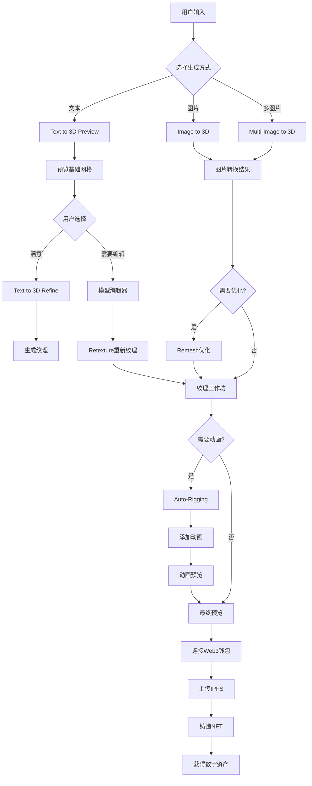

# 3D NFT 前端业务设计 (基于Meshy API v2.0)

## 📋 更新后的业务流程

### 核心用户故事
> 作为用户，我希望通过文本或图片生成高质量的3D模型，经过预览、编辑、优化后铸造为NFT，并在区块链上拥有该数字资产的所有权

### 🎯 增强的主要业务流程



## 🎯 增强的功能模块

### 1. AI 生成中心 (AI Generation Hub)
**页面**: `/generate`

**主要功能**:
- **多种输入方式**:
  - 文本prompt生成 (Text to 3D)
  - 单图片生成 (Image to 3D)  
  - 多图片生成 (Multi-Image to 3D)
- **两阶段生成流程**:
  - Preview阶段: 生成基础网格 (5 credits)
  - Refine阶段: 添加高质量纹理 (10 credits)
- **高级参数控制**:
  - 艺术风格: realistic, sculpture
  - AI模型选择: meshy-4, meshy-5
  - 拓扑类型: quad, triangle
  - 多边形数量: 100-300,000
  - 对称性控制: off, auto, on

**UI组件**:
```typescript
// 增强的生成组件
GenerationModeSelector - 选择生成方式 (文本/图片/多图片)
AdvancedPromptInput - 智能提示输入(600字符限制)
ImageUploader - 单/多图片上传器
GenerationSettings - 高级参数面板
  ├── StyleSelector - 艺术风格选择
  ├── ModelSelector - AI模型选择  
  ├── TopologySelector - 拓扑类型选择
  ├── PolycountSlider - 多边形数量控制
  └── SymmetryToggle - 对称性控制
TwoStageProgress - 双阶段进度追踪
PreviewGallery - Preview结果展示
RefineSelector - 选择进入Refine的模型
```

### 2. 高级模型编辑器 (Model Editor)
**页面**: `/editor/:modelId`

**主要功能**:
- **网格重构 (Remesh)**:
  - 调整多边形数量
  - 改变拓扑结构 (quad ↔ triangle)
  - 模型缩放和原点调整
  - 格式转换 (GLB, FBX, OBJ, USDZ, STL, Blender)
- **纹理工作坊 (Retexture)**:
  - 文本驱动纹理重生成
  - 图片参考纹理应用
  - PBR材质生成 (金属度、粗糙度、法线)
  - UV映射选项

**UI组件**:
```typescript
ModelEditor3D - 主要3D编辑器
  ├── EditModeSelector - 编辑模式选择
  ├── RemeshPanel - 网格重构面板
  │   ├── PolycountAdjuster - 多边形调整器
  │   ├── TopologyConverter - 拓扑转换器
  │   ├── ModelResizer - 模型缩放器
  │   └── OriginPositioner - 原点调整器
  ├── TextureWorkshop - 纹理工作坊
  │   ├── TextPromptRetexture - 文本纹理生成
  │   ├── ImageStyleApplier - 图片风格应用
  │   ├── PBRMapGenerator - PBR贴图生成器
  │   └── UVMapController - UV映射控制
  └── FormatExporter - 格式导出器
PreviewComparison - 编辑前后对比
EditHistoryPanel - 编辑历史记录
CostCalculator - 编辑费用计算器
```

### 3. 动画工作室 (Animation Studio)
**页面**: `/animation/:modelId`

**主要功能**:
- **自动绑定 (Auto-Rigging)**:
  - 人形模型自动骨骼生成
  - 角色高度调整
  - 纹理优化
- **动画应用**:
  - 基础动画库: 行走、跑步
  - 动画预览和调试
  - FPS调整和优化

**UI组件**:
```typescript
AnimationStudio - 动画工作室主界面
  ├── ModelValidator - 模型适配性检测
  ├── RiggingPanel - 绑定控制面板
  │   ├── CharacterHeightAdjuster - 角色高度调整
  │   ├── AutoRigger - 自动绑定工具
  │   └── RigPreview - 骨骼预览器
  ├── AnimationLibrary - 动画库
  │   ├── WalkingAnimation - 行走动画
  │   ├── RunningAnimation - 跑步动画
  │   └── CustomAnimationUploader - 自定义动画上传
  └── AnimationPlayer - 动画播放器
     ├── PlaybackControls - 播放控制
     ├── FPSController - 帧率控制
     └── ExportSettings - 导出设置
```

### 4. 增强的3D预览器 (Enhanced Model Viewer)
**页面**: `/preview/:taskId`

**主要功能**:
- **多格式预览**: GLB, FBX, OBJ切换
- **PBR材质展示**: 实时渲染金属度、粗糙度、法线
- **动画播放**: 支持rigged模型的动画预览
- **质量对比**: Preview vs Refine对比
- **技术信息**: 多边形数、拓扑类型、文件大小

**UI组件**:
```typescript
EnhancedModelViewer3D - 增强3D查看器
  ├── FormatSwitcher - 格式切换器
  ├── PBRMaterialViewer - PBR材质查看器
  │   ├── MetallicViewer - 金属度查看
  │   ├── RoughnessViewer - 粗糙度查看
  │   └── NormalMapViewer - 法线贴图查看
  ├── AnimationPlayer - 动画播放器 (如果有)
  ├── QualityComparison - 质量对比工具
  └── TechnicalInfoPanel - 技术信息面板
AdvancedViewerControls - 高级查看控制
  ├── LightingControls - 光照控制
  ├── EnvironmentSelector - 环境选择
  └── RenderModeToggle - 渲染模式切换
ModelAnalytics - 模型分析面板
  ├── GeometryStats - 几何统计
  ├── TextureInfo - 纹理信息
  └── PerformanceMetrics - 性能指标
```

### 5. 费用管理系统 (Credit Management)
**页面**: 全局集成

**主要功能**:
- **实时余额显示**: 基于Balance API
- **操作费用预估**: 根据选择的操作计算费用
- **使用历史追踪**: 详细的API调用记录
- **费用优化建议**: 帮助用户节省credits

**UI组件**:
```typescript
CreditManager - 费用管理器
  ├── BalanceDisplay - 余额显示
  ├── CostCalculator - 费用计算器
  │   ├── OperationCostPreview - 操作费用预览
  │   ├── BatchCostEstimator - 批量费用估算
  │   └── OptimizationSuggestions - 优化建议
  ├── UsageHistory - 使用历史
  │   ├── APICallLog - API调用日志
  │   ├── CreditUsageChart - 使用量图表
  │   └── CostBreakdown - 费用分解
  └── CreditPurchase - 购买入口
```

## 🏗️ 增强的技术架构

### 前端技术栈 (含TanStack Query)
```json
{
  "framework": "Next.js 15 (App Router)",
  "language": "TypeScript",
  "styling": "Tailwind CSS 4",
  "3d_engine": "React Three Fiber + Three.js",
  "web3": "wagmi + viem",
  "state": "Zustand + TanStack Query",
  "ui_library": "shadcn/ui + Radix UI",
  "data_fetching": "TanStack Query (React Query)",
  "file_handling": "react-dropzone + file validation"
}
```

### 页面路由结构 (更新)
```
/                           - 首页 (Hero + 功能展示)
/generate                   - AI生成中心
  ├── /text-to-3d          - 文本生成3D
  ├── /image-to-3d         - 图片生成3D  
  └── /multi-image-to-3d   - 多图片生成3D
/editor/:modelId            - 模型编辑器
  ├── /remesh              - 网格重构
  └── /retexture           - 纹理编辑
/animation/:modelId         - 动画工作室
/preview/:taskId            - 增强预览器
/mint/:modelId              - NFT铸造页面
/profile                    - 个人中心
  ├── /collection          - 个人收藏
  ├── /credits             - 费用管理
  └── /history             - 使用历史
/marketplace                - NFT市场
/explore                    - 发现页面
/asset/:tokenId             - NFT详情页面
/tools                      - 创作者工具
  ├── /batch-processor     - 批量处理
  ├── /format-converter    - 格式转换
  └── /optimization        - 模型优化
```

### TanStack Query 集成方案

```typescript
// lib/react-query/meshy-queries.ts
export const meshyQueries = {
  // 余额查询
  balance: () => ({
    queryKey: ['meshy', 'balance'],
    queryFn: () => meshyClient.getBalance(),
    staleTime: 1000 * 60 * 2, // 2分钟
  }),

  // 任务状态查询
  taskStatus: (taskId: string) => ({
    queryKey: ['meshy', 'task', taskId],
    queryFn: () => meshyClient.getTaskStatus(taskId),
    refetchInterval: (data) => {
      // 任务完成后停止轮询
      return data?.status === 'SUCCEEDED' ? false : 3000;
    },
    enabled: !!taskId,
  }),

  // 用户任务历史
  userTasks: (page: number = 1) => ({
    queryKey: ['meshy', 'user-tasks', page],
    queryFn: () => meshyClient.getUserTasks(page),
    staleTime: 1000 * 60 * 5, // 5分钟
  }),
};

// React Query Hooks
export function useBalance() {
  return useQuery(meshyQueries.balance());
}

export function useTaskStatus(taskId: string) {
  return useQuery(meshyQueries.taskStatus(taskId));
}

export function useTextTo3D() {
  const queryClient = useQueryClient();
  
  return useMutation({
    mutationFn: (params: TextTo3DParams) => meshyClient.textTo3D(params),
    onSuccess: (data) => {
      // 任务创建成功后，开始轮询状态
      queryClient.invalidateQueries(['meshy', 'task', data.task_id]);
      // 更新余额
      queryClient.invalidateQueries(['meshy', 'balance']);
    },
  });
}
```

## 🎨 新增用户体验功能

### 1. 智能创作助手
- **Prompt优化建议**: AI驱动的prompt改进建议
- **风格推荐**: 基于历史偏好的风格推荐
- **参数预设**: 常用参数组合的快速应用

### 2. 协作功能
- **模型分享**: 分享生成结果给其他用户
- **协作编辑**: 多用户协同编辑模型
- **社区画廊**: 展示优秀创作作品

### 3. 学习中心
- **教程系统**: 从入门到高级的完整教程
- **最佳实践**: 各种类型模型的生成技巧
- **案例研究**: 成功的商业应用案例

## 📊 业务指标和限制

### 操作费用表
| 操作类型 | 费用 (Credits) | 说明 |
|----------|----------------|------|
| Text to 3D Preview | 5 | 基础网格生成 |
| Text to 3D Refine | 10 | 纹理化 |
| Image to 3D (无纹理) | 5 | 基础模型 |
| Image to 3D (有纹理) | 15 | 完整模型 |
| Retexture | 10 | 重新纹理化 |
| Remesh | 5 | 网格优化 |
| Auto-Rigging | 5 | 骨骼绑定 |
| Animation | 3 | 动画应用 |

### 技术限制
- **文件保留**: 标准用户3天，企业用户无限期
- **Prompt长度**: 最大600字符
- **多边形范围**: 100-300,000 (根据账户等级)
- **动画限制**: 仅支持人形模型
- **图片格式**: JPG, JPEG, PNG

### 质量等级
- **Meshy-4**: 标准质量，更快生成
- **Meshy-5**: 更高质量，稍慢生成

## 🚀 创新功能点

### 1. 智能批量处理
```typescript
interface BatchProcessor {
  // 批量remesh不同多边形数量
  generateLODs: (model: string, levels: number[]) => Promise<ModelLOD[]>;
  
  // 批量应用不同纹理风格
  textureVariants: (model: string, styles: string[]) => Promise<TextureVariant[]>;
  
  // 批量格式转换
  convertFormats: (model: string, formats: string[]) => Promise<FormatVariant[]>;
}
```

### 2. AI驱动的优化建议
```typescript
interface OptimizationEngine {
  // 基于用途推荐参数
  recommendSettings: (usage: 'game' | 'vr' | 'print' | 'web') => GenerationSettings;
  
  // 模型质量评估
  assessQuality: (model: string) => QualityReport;
  
  // 费用优化建议
  optimizeCosts: (operations: Operation[]) => CostOptimization;
}
```

### 3. 专业创作工具
```typescript
interface ProCreatorTools {
  // 模型系列生成
  generateSeries: (basePrompt: string, variations: string[]) => Promise<ModelSeries>;
  
  // 品牌一致性检查
  checkBrandConsistency: (models: string[]) => ConsistencyReport;
  
  // 商业授权管理
  manageLicensing: (model: string, license: LicenseType) => void;
}
```

---

*设计版本: v2.0*  
*更新时间: 2025-08-16*  
*基于Meshy AI官方API文档*