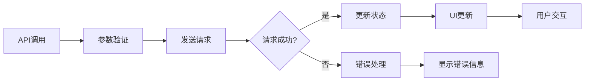

# Generate页面优化记录

> 文档创建时间：2025-01-17  
> 记录人：Claude Code Assistant  
> 项目：GEN-3D-ASSESTS_lemon

## 概述

本文档记录了Generate页面的重大优化工作，主要包括：
1. 修复纹理生成API调用bug
2. 添加智能NFT铸造功能
3. 优化页面UI布局和用户体验
4. 删除重复功能，明确组件职责

---

## 🐛 Bug修复记录

### 1. 纹理生成API参数错误

**问题描述：**
```
Either text_style_prompt or image_style_url must be provided
src\lib\meshy\client.ts (81:12) @ MeshyClient.handleError
```

**根本原因：**
- API请求体中使用了错误的参数名 `prompt`
- Meshy API实际需要的参数是 `text_style_prompt`

**解决方案：**
```typescript
// 修复前 - 错误的参数名
const requestBody: any = {
  model_url: params.model_url,
  prompt: params.prompt,  // ❌ API不识别
};

// 修复后 - 正确的参数名  
const requestBody: any = {
  model_url: params.model_url,
  text_style_prompt: params.prompt,  // ✅ 正确
};
```

**文件位置：** `web/src/lib/meshy/client.ts:167`

### 2. APIError构造函数调用问题

**问题描述：**
```
TypeScript编译错误：new APIError() 调用语法问题
```

**解决方案：**
```typescript
// 修复前 - 直接返回构造函数调用
return new APIError(message, status, code, details);

// 修复后 - 先创建实例再返回
const error = new APIError(message, status, code, details);
return error;
```

**文件位置：** `web/src/lib/meshy/client.ts:81`

### 3. 页面滚动显示问题

**问题描述：**
- 中间面板使用了固定高度，内容无法滚动
- 右侧面板的模型信息区域高度固定，mint按钮可能被隐藏

**解决方案：**
```typescript
// 修复前 - 固定高度导致内容截断
<div className="h-full flex flex-col">
  <div className="flex-1 min-h-[400px]">

// 修复后 - 添加滚动支持
<div className="overflow-y-auto">
  <div className="min-h-[400px] max-h-[600px]">
```

**文件位置：** `web/src/components/generation/TGeneratePage.tsx:353-367`

---

## 🎯 NFT铸造功能实现

### 1. 功能需求分析

**用户需求：**
- 单一mint按钮，智能选择最佳模型
- 优先铸造带纹理的模型，如果没有纹理则铸造白膜
- 按钮位置固定，减少用户困惑

### 2. 技术实现方案

#### 2.1 智能模型选择逻辑

```typescript
const getBestModelForMint = () => {
  // 优先使用纹理模型，如果没有则使用白膜
  if (textureTaskStatus && textureTaskStatus.status === 'SUCCEEDED') {
    return {
      taskResult: textureTaskStatus,
      type: 'texture',
      label: '铸造纹理NFT'
    };
  } else if (taskStatus && taskStatus.status === 'SUCCEEDED') {
    return {
      taskResult: taskStatus,
      type: 'base', 
      label: '铸造3D NFT'
    };
  }
  return null;
};
```

#### 2.2 UI组件集成

**位置：** 右侧面板，模型信息区域，下载按钮旁边

```tsx
{bestModel && (
  <NFTMintDialog 
    taskResult={bestModel.taskResult} 
    trigger={
      <Button 
        variant="default" 
        size="sm" 
        className="bg-green-600 hover:bg-green-700"
      >
        <Coins className="h-3 w-3 mr-1" />
        {bestModel.label}
      </Button>
    }
  />
)}
```

#### 2.3 状态管理优化

**简化前：** 复杂的多状态管理
- `taskStatus` (白膜状态)
- `textureTaskStatus` (纹理状态)  
- 多个mint按钮
- 复杂的条件判断

**简化后：** 统一的状态管理
- 单一数据源
- 智能选择逻辑
- 一个mint按钮
- 清晰的用户反馈

---

## 🔄 工作流程

### 1. 用户操作流程

```mermaid
graph TB
    A[用户输入提示词] --> B[点击"Start Generate"]
    B --> C[生成3D白膜]
    C --> D{生成成功?}
    D -->|是| E[显示mint按钮]
    D -->|否| F[显示错误信息]
    E --> G[用户可选择铸造白膜NFT]
    E --> H[或在3D预览中生成纹理]
    H --> I[纹理生成完成]
    I --> J[3D预览自动更新为纹理模型]
    J --> K[用户铸造纹理NFT]
```

### 2. 技术处理流程



### 3. 组件职责分工

| 组件 | 职责 | 文件位置 |
|------|------|----------|
| `TGeneratePage` | 3D模型生成、基础NFT铸造 | `web/src/components/generation/TGeneratePage.tsx` |
| `SimpleModel3DViewer` | 模型展示、纹理生成 | `web/src/components/3d/SimpleModel3DViewer.tsx` |
| `NFTMintDialog` | NFT铸造对话框 | `web/src/components/web3/NFTMintDialog.tsx` |
| `MeshyClient` | API调用封装 | `web/src/lib/meshy/client.ts` |

---

## 📊 优化效果

### 1. 代码质量提升

- **删除重复代码：** 移除了generate页面中重复的纹理生成功能
- **简化状态管理：** 减少了不必要的状态变量
- **提高可维护性：** 明确了组件职责边界

### 2. 用户体验改进

- **界面简洁：** 删除了冗余的UI元素
- **操作直观：** 单一mint按钮，智能选择最佳模型
- **引导清晰：** 明确告知用户纹理生成位置

### 3. 性能优化

- **减少渲染：** 删除了不必要的状态监听
- **优化滚动：** 解决了内容截断问题
- **提升响应速度：** 简化了组件逻辑

---

## 🛠️ 技术细节

### 1. 关键文件修改

| 文件 | 修改内容 | 行数变化 |
|------|----------|----------|
| `client.ts` | 修复API参数错误 | ~10行 |
| `TGeneratePage.tsx` | 添加mint功能，删除重复纹理生成 | ~100行 |
| `page.tsx` | 调整默认布局 | ~5行 |

### 2. 新增依赖

```typescript
import { NFTMintDialog } from '@/components/web3/NFTMintDialog';
import { Coins } from 'lucide-react';
```

### 3. 删除的依赖

```typescript
// 不再需要的imports
import { useTextToTexture, useTextureTaskStatus } from '@/hooks/use-meshy';
import { Palette } from 'lucide-react';
```

---

## 🔮 后续优化建议

### 1. 功能增强

- [ ] 添加mint进度指示器
- [ ] 支持批量mint操作
- [ ] 增加mint历史记录

### 2. 性能优化

- [ ] 实现组件懒加载
- [ ] 优化API请求缓存
- [ ] 添加错误重试机制

### 3. 用户体验

- [ ] 添加操作引导动画
- [ ] 支持键盘快捷键
- [ ] 优化移动端适配

---

## 📝 总结

本次优化成功解决了Generate页面的关键bug，并添加了完整的NFT铸造功能。主要成果：

1. **✅ Bug修复：** 解决了纹理生成API调用失败问题
2. **✅ 功能完善：** 添加了智能NFT铸造功能
3. **✅ 体验提升：** 优化了页面布局和用户交互
4. **✅ 代码优化：** 删除了重复功能，提高了代码质量

整体提升了用户的3D模型生成和NFT铸造体验，为后续功能扩展奠定了良好基础。